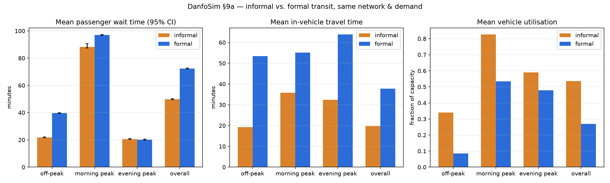

# Does going informal actually help? Simulating Lagos danfo transit against a fixed-route baseline

Most people in Lagos get around on danfo minibuses and keke napep tricycles. These don't run on a timetable. There's no fixed stop in the way a proper bus route has one, and the guy driving is trying to make money that day, not hit a schedule. A danfo leaves when it's full enough. Drivers will cut a trip short if there's a better fare waiting somewhere else. Almost none of this matches how transit simulation normally works, because almost every agent-based transit model out there assumes fixed routes and fixed headways. That's how the systems most researchers actually study behave.

So I wanted an actual number, not just a hunch: does that flexibility buy you anything? If you swapped in a fixed-route, fixed-headway system instead, same roads, same number of vehicles, same passengers going the same places, would it be worse, better, or would it just depend on when you happened to look?

I built a simulation to find out. Below is what I found, and where I think the model is still shaky.

## Nobody has actually run this comparison

I went looking for a real head-to-head benchmark, informal versus formal transit on the same network with the same demand, and couldn't find one. Fixed-route transit simulation is a mature field (MATSim and its relatives have been doing large-scale microsimulation for decades). Work on informal transit in African cities exists too, but most of it is qualitative or policy-focused. It describes how danfo and matatu systems behave. It doesn't build something you could actually run an experiment on.

Which cuts both ways. It means the comparison itself is a real contribution and not a rehash of something done better elsewhere. It also means I have almost nothing to calibrate against: no ridership counts, no GPS traces, no fare data for Lagos's informal network. What I do have is a set of well-documented qualitative facts: no fixed schedule, threshold-based departure, route flexibility, a strong morning and evening commute peak. I built the model's structure around those and tried to be upfront everywhere else about which numbers are backed by something real and which ones I just tuned until the output stopped looking absurd. Every parameter is logged in `docs/CALIBRATION.md` with which bucket it falls into. If someone's going to argue with this project, I'd rather they argue with a specific number in that file than with the headline result.

## What the model actually simulates

The network is six radial corridors feeding into one shared CBD node. That's roughly the real shape of Lagos's road geography: a handful of arterial routes converging on Lagos Island and the Mainland business districts, with the well-known chokepoints (the bridges, mostly) sitting right at the CBD end of each corridor. Those edges get a steeper congestion curve than the rest of the network.

Passenger demand follows a time-varying Poisson process, with a morning peak heading toward the CBD and an evening peak heading home. This is the one part of the demand model I feel genuinely confident about, since the AM/PM commute pattern is about as well documented as anything gets.

Informal vehicles run as a state machine. Wait and pick up passengers until you hit a load threshold or a max-wait timer, then go. While en route there's a small chance of cutting the trip short at whatever junction it's passing, if that looks like a better move. This is the "drop the passengers and go chase demand somewhere else" behavior that's actually pretty central to how danfo drivers operate. And when a vehicle passes an intermediate junction without cutting the trip short, it still picks up anyone waiting there, because that's just how curbside hailing works. You don't need to formally stop to take on a passenger.

The formal baseline is what you'd expect: fixed route, fixed headway from the terminus, a hard capacity limit. It took a real bug to discover it also needs to stop and board passengers at every junction along the route, not just the terminus. My first version only boarded at the start of the line, so every intermediate stop's demand just piled up forever with no vehicle ever there to serve it. Adding a short dwell at each junction fixed it.

Everything runs as batched tensor operations, 200 simulated days at once, with no Python loop over individual vehicles or passengers. A full day's simulation for both regimes takes a few seconds on a CPU. I never actually ended up needing the GPU this project was scoped around. The fleet sizes involved, tens of vehicles per corridor, are just too small to be compute-bound. Worth knowing if you're repeating something like this: don't over-invest in GPU infrastructure at this scale.

## The main result

Same network, same demand, same fleet size (40 vehicles) for both regimes, run across 200 simulated days so I could put a confidence interval on the numbers instead of reporting whatever a single run happened to give me.

| | mean wait | mean travel time | utilisation | trips served |
|---|---|---|---|---|
| Informal | 49.8 min (95% CI 49.3–50.3) | 19.8 min | 0.54 | 297,407 |
| Formal | 72.4 min (95% CI 72.1–72.7) | 37.8 min | 0.27 | 129,400 |



Informal wins and it isn't close: lower wait, lower travel time, double the utilisation, more than double the trips served with an identical fleet. Breaking it out by time of day is where it stops being a one-line story.

- **Morning peak**: informal wait is 88.3 min against formal's 97.0 min. Still a win, but the gap is proportionally smaller than off-peak. Travel time diverges harder here (35.8 vs 55.1 min) because the formal fleet has to run the full fixed route through worsening congestion while informal vehicles are short-turning out of it.
- **Off-peak**: this is where informal's advantage is biggest in relative terms, 21.7 min against 39.7 min. Honestly this surprised me. I expected the threshold-departure rule to hurt informal here, since a danfo waiting to fill up when passengers trickle in slowly should lose to a bus running on a predictable schedule regardless of load. That crossover never showed up. My guess is the `max_wait_before_departure_anyway` safety valve, capped at 8 minutes by default, is doing enough work on its own to keep the threshold rule from ever really costing informal much.
- **Evening peak**: the one bucket where the two regimes are statistically indistinguishable. 20.6 min for informal, 20.2 min for formal, confidence intervals overlapping. The "informal wins everywhere" headline has one real exception, and I don't have a great explanation for it. My best guess is that outbound demand from the CBD is more spatially concentrated than inbound demand, since everyone starts from the same hub node, and that plays more to a scheduled system's strengths. I haven't actually checked that though.

Call it what it is: informal transit's flexibility pays off almost everywhere in this model. The one place it doesn't is a real result, not noise, and it's the kind of thing I'd want to dig into more before writing it into anything more confident than this.

## What actually moves the numbers

Two follow-up sweeps, run either informal-only or as an informal/formal pair, both again across the full 200-day batch.

**Threshold sensitivity.** I swept `departure_threshold` (how full a vehicle needs to be before it's allowed to leave) from 0.5 to 1.0, and `max_wait_before_departure_anyway` from 4 to 15 minutes. The threshold barely matters on its own: wait time moves by less than a minute across the whole 0.5 to 1.0 range at a fixed max-wait. What actually drives the tradeoff is the max-wait cap. Pushing it from 4 to 15 minutes takes mean wait from 48.8 to 61.0 minutes but takes utilisation from 0.47 to 0.65. That's the real dial an operator, or a policymaker trying to nudge their behavior, is turning. Not "how full is full enough" but "how long are you willing to let people wait before you leave anyway."

**Congestion sensitivity.** I scaled the background traffic congestion term from a quarter of its default severity up to four times it, running both regimes at each level. Informal's absolute wait-time advantage grows a lot as congestion gets worse, from a 16-minute edge at the lightest setting to a 330-minute edge at the heaviest, significant at every level I tested. But the relative advantage, informal's wait as a fraction of formal's, stays close to constant, somewhere around 1.4 to 1.5x, across the whole range. Flexibility doesn't stop mattering once congestion gets bad enough for travel time to dominate wait time. If anything the raw benefit gets bigger. It just doesn't get proportionally bigger.

One thing about the congestion model itself, since I almost shipped it broken: I initially built it so only the simulated transit vehicles counted toward road congestion, and a fleet of 40 vehicles spread across a few dozen road segments is nowhere near dense enough to ever load a bottleneck edge on its own. The sweep was completely flat until I noticed and fixed it. Real Lagos bridge congestion comes overwhelmingly from general traffic, not danfo density, so I added a background traffic term tied to time of day and bottleneck status. That's logged as an assumption in the calibration doc, not something I'm pretending is measured.

## Does competition make dispatch more disciplined?

The last piece asks a different kind of question. If you replace the fixed threshold rule with a policy that learns when to depart, trained to maximize something like revenue per trip while paying a cost for wait time so it can't just collapse to "leave immediately, always," does the emergent departure pattern get more regular as more drivers compete for the same passengers? That's a real open question about informal transit: does market pressure eventually produce something that looks like a schedule, even with nobody imposing one?

In this model, no. The opposite happens. I trained a separate policy from scratch at each fleet size (10, 20, 40, 80 vehicles) so each one reaches its own equilibrium instead of just testing one policy outside the conditions it was trained under, and the variance in time between departures climbs sharply as the fleet grows:

| fleet size | inter-departure variance | coefficient of variation |
|---|---|---|
| 10 | 0.024 | 0.60 |
| 20 | 0.032 | 0.65 |
| 40 | 0.113 | 0.98 |
| 80 | 2.81 | 1.19 |

I didn't trust this the first time I saw it. A jump like that at fleet size 80 looked like it could easily be an artifact, gaps pooled across corridors that just happen to run at different average paces rather than anything about individual drivers. So I decomposed it into within-corridor variance and between-corridor variance. Between-corridor variance stays two orders of magnitude smaller than within-corridor at every fleet size, and the coefficient of variation, which is scale-free so it isn't just "gaps got bigger," climbs the whole way too. That rules out the pooling artifact. The effect is real. Individual operators get more erratic, not less, as more of them compete for the same stops.

My best guess at why: with more vehicles chasing the same demand pool, each one's time-to-fill depends more on random luck about who else happens to be waiting at the same junction at the same moment. Competition adds noise to each operator's own cycle instead of averaging it out. It's also consistent with something people who've written about matatu and danfo systems have noted anecdotally: intense competition for passengers doesn't spontaneously produce anything resembling a schedule.

## Where I'd push back on this if I were reviewing it

A few things this model hasn't earned the right to claim.

The demand numbers are tuned, not measured. I picked a base arrival rate that produces plausible-looking wait times, single digits to a few tens of minutes, rather than one backed by an actual ridership count, because my first attempt gave 100+ minute average waits that were obviously wrong. That's a real limitation. It means I'd trust the comparison between regimes, which holds under the same demand assumptions for both, a lot more than I'd trust any of the absolute minute values sitting on their own.

A dropped passenger counts as a completed trip in this model. When an informal vehicle short-turns and ends a trip early, nothing tracks that the passenger might now need a second vehicle to actually finish their journey. That almost certainly overstates informal throughput and understates informal travel time next to a model that handled transfers properly.

Boarding isn't symmetric between the two fleets, either. Formal buses pay a fixed dwell cost at every stop. Informal vehicles get a free rolling pickup with no dwell time at all, which reflects how curbside hailing actually works, but it's also a choice that mechanically favors informal, and I'd rather that be on the record than found by someone else later.

And this is single-city, single-network calibration, so none of it should be read as "here's what Lagos wait times actually are." Read it as "here's what happens to the comparison between two operating models when demand and road network are held fixed," which is a narrower and more defensible claim.

## Running it

```
pip install -r requirements-lock.txt
pytest -q                                    # 35 tests, ~2 seconds
python scripts/run_comparison.py             # the headline result above
python scripts/run_sensitivity.py threshold
python scripts/run_sensitivity.py congestion
python scripts/run_dispatch_train.py         # the fleet-size sweep, ~90s on CPU
```

All of it ran on CPU in well under a couple of minutes total, seeded and reproducible. `docs/CALIBRATION.md` lists every parameter and whether it's cited or assumed. The code is the real specification of the model, and the tests are the real specification of what I believe it gets right.
